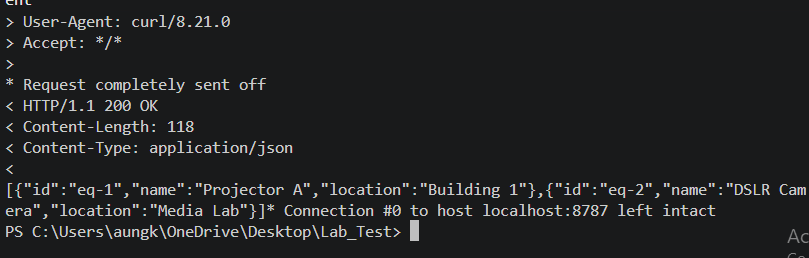
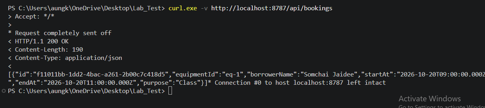
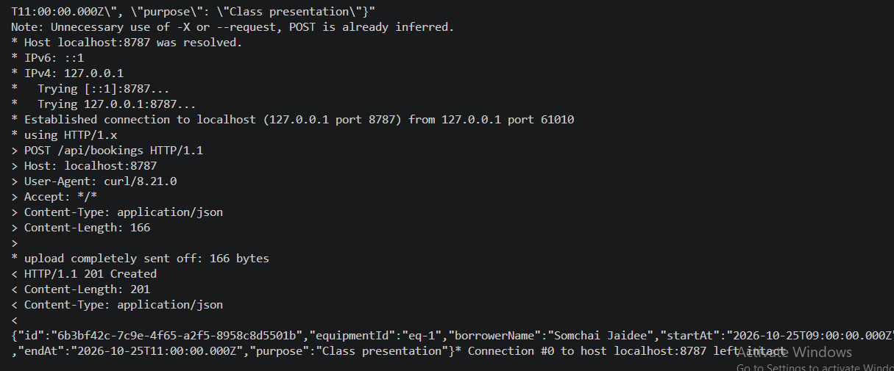
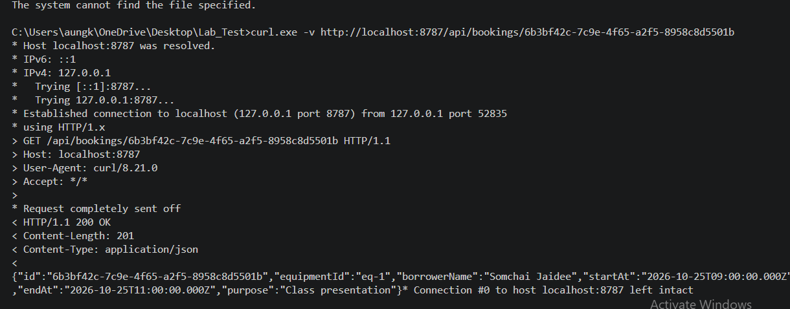
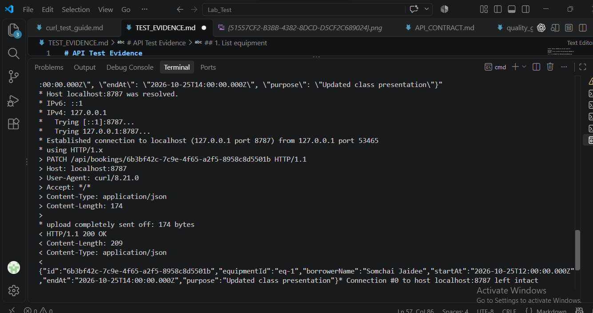
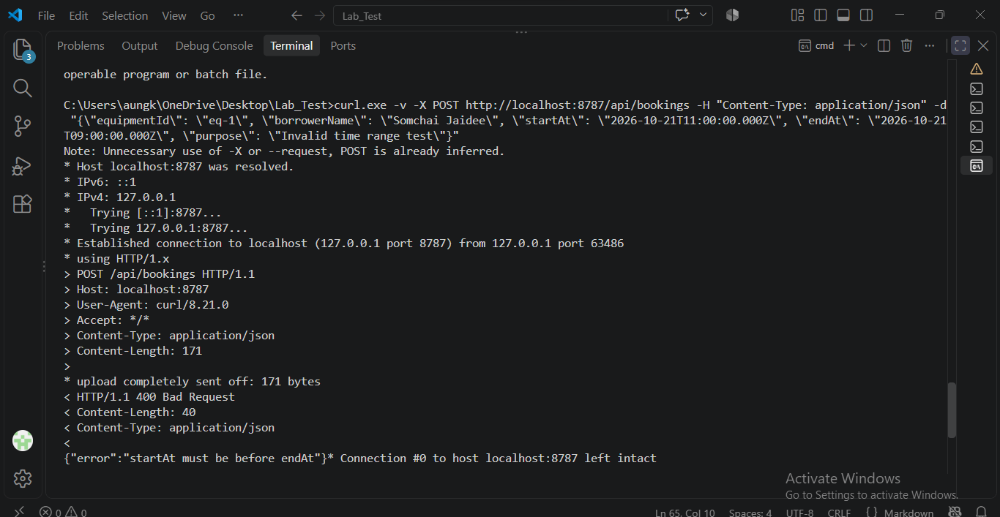
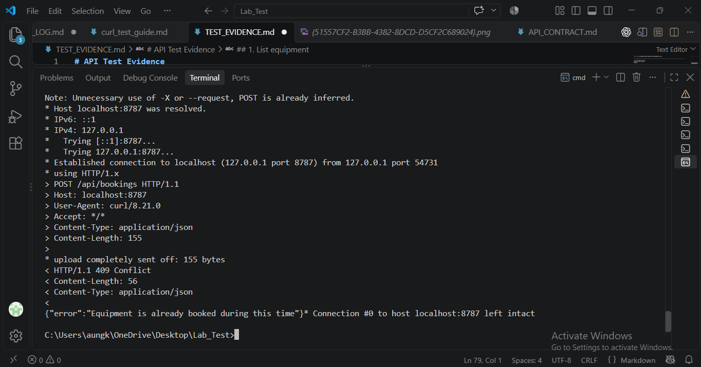
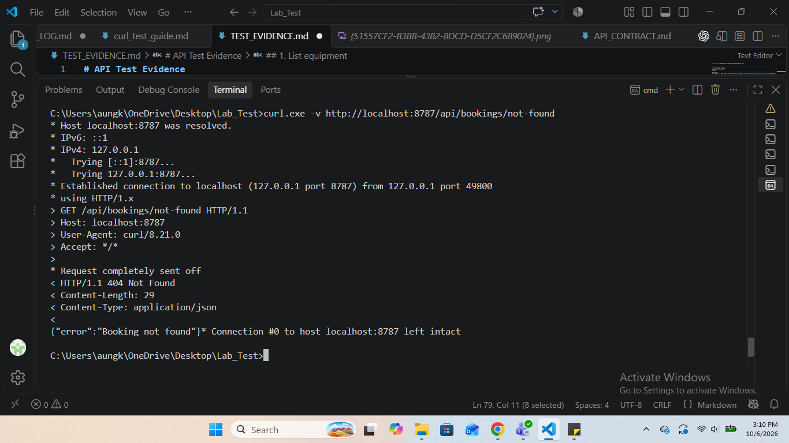
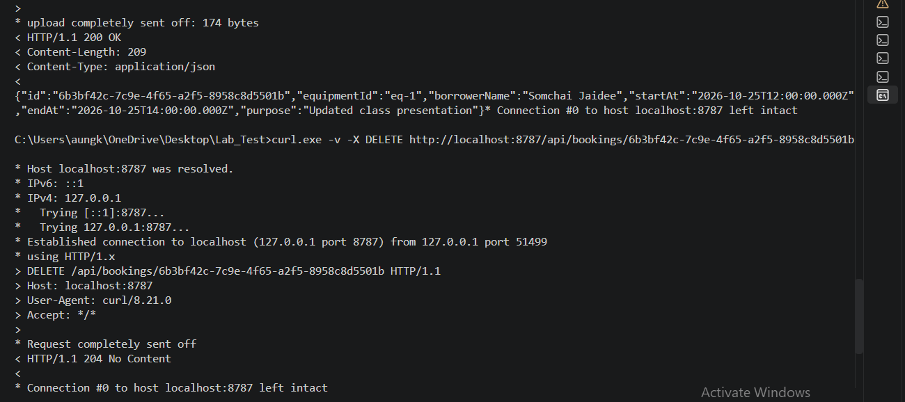

# API Test Evidence

**Base URL Used:** `http://localhost:8787/api`

## 1. List equipment
**Expected:** `200 OK`
**Command:**
```powershell
curl.exe -v http://localhost:8787/api/equipment


__________________________________________________________________
2. List bookings
Expected: 200 OK
Command:

PowerShell
curl.exe -v http://localhost:8787/api/bookings


______________________________________________________________

3. Create a booking
Expected: 201 Created
Command:

PowerShell
curl.exe -v -X POST http://localhost:8787/api/bookings -H "Content-Type: application/json" -d "{\"equipmentId\": \"eq-1\", \"borrowerName\": \"Somchai Jaidee\", \"startAt\": \"2026-10-20T09:00:00.000Z\", \"endAt\": \"2026-10-20T11:00:00.000Z\", \"purpose\": \"Class presentation\"}"



(Note: Copy the id from the JSON response in this screenshot for steps 4, 5, and 9)

__________________________________________________________________________________

4. Get one booking
Expected: 200 OK
Command: (Replace <BOOKING_ID> with your copied ID)

PowerShell
curl.exe -v http://localhost:8787/api/bookings/<BOOKING_ID>
Evidence:



_______________________________________________________________________

5. Update a booking
Expected: 200 OK
Command: (Replace <BOOKING_ID> with your copied ID)

PowerShell
curl.exe -v -X PATCH http://localhost:8787/api/bookings/<BOOKING_ID> -H "Content-Type: application/json" -d "{\"equipmentId\": \"eq-1\", \"borrowerName\": \"Somchai Jaidee\", \"startAt\": \"2026-10-20T12:00:00.000Z\", \"endAt\": \"2026-10-20T14:00:00.000Z\", \"purpose\": \"Updated class presentation\"}"
Evidence:


_____________________________________________________________________________________

6. Invalid time range
Expected: 400 Bad Request
Command:

PowerShell
curl.exe -v -X POST http://localhost:8787/api/bookings -H "Content-Type: application/json" -d "{\"equipmentId\": \"eq-1\", \"borrowerName\": \"Somchai Jaidee\", \"startAt\": \"2026-10-21T11:00:00.000Z\", \"endAt\": \"2026-10-21T09:00:00.000Z\", \"purpose\": \"Invalid time range test\"}"
Evidence:



__________________________________________________________________________________________________

7. Overlapping booking
Expected: 409 Conflict
Command:

PowerShell
curl.exe -v -X POST http://localhost:8787/api/bookings -H "Content-Type: application/json" -d "{\"equipmentId\": \"eq-1\", \"borrowerName\": \"Suda Dee\", \"startAt\": \"2026-10-20T12:30:00.000Z\", \"endAt\": \"2026-10-20T13:30:00.000Z\", \"purpose\": \"Conflict test\"}"
Evidence:


__________________________________________________________________________________________

8. Missing booking
Expected: 404 Not Found
Command:

PowerShell
curl.exe -v http://localhost:8787/api/bookings/not-found
Evidence:



____________________________________________________________________

9. Delete a booking
Expected: 204 No Content
Command: (Replace <BOOKING_ID> with your copied ID)

PowerShell
curl.exe -v -X DELETE http://localhost:8787/api/bookings/<BOOKING_ID>
Evidence:

